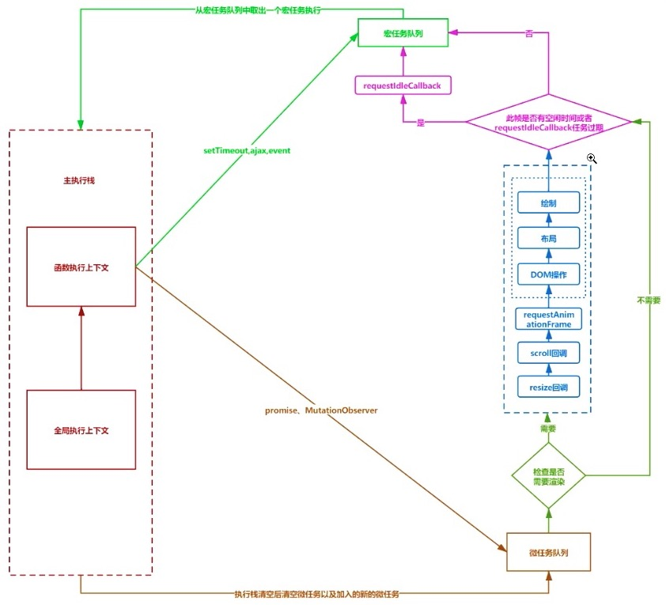

# JavaScript 事件循环

> 实际 JS 引擎没有事件循环，使用的就是宿主(浏览器、Node)的事件循环，这里指的是浏览器事件循环

### 事件循环

常见显示器的刷新频率为`60hz`，即每秒刷新`60`次，平均`16.6ms`渲染一帧画面。
这一帧会做三件事：`[macrotask -> microtask] + render`，宏任务与微任务的循环执行的过程便称为事件循环

### 宏任务(macrotask)

> `requestAnimationFrame`、`requestIdleCallback`既不是宏任务，也不是微任务，只是浏览器在特定时机调用的回调函数
> 实际下面的宏任务、微任务都是指遇到使用这些的情况时，将其`回调函数`加入对应的队列，等待按顺序执行

宏任务包括：script(全局代码；js 修改`dom`及之后的更新页面是同步的，页面更新完毕后才继续执行后续 js，`强制同步渲染`)、定时器`fire`事件(`setTimeout`、`setInterval`、`setImmediate`(非标准，仅 IE10+、Edge 实现，其他浏览器未实现；Node.js 环境))、`AJAX`事件、`输入`事件(鼠标滚动、点击、移动，键盘输入等)、`MessageChannel`、`文件读写`(I/O)事件、DOM 解析、样式计算(`Recalculate Style`)、布局计算(`Layout`)、CSS 动画 等。每个宏任务都会关联一个`微任务队列`

### 微任务(microtask)

微任务包括：`Promise.then`、`Promise.reject`、 `DOM 变化`事件：节点的插入、修改、删除等动态变化事件，包括`MutationObserver`、加载卸载事件(`onload`、`onbeforeunload`、`onunload`等，暂时这样理解，待继续确认:)、`queueMicrotask`、`process.nextTick`(Node.js 环境）等

另外可理解为：`宿主`发起的任务是`宏任务`，如点击事件，setTimeout 进入宏任务队列；`js 引擎`发起的任务是`微任务`，如 promise

### 运行机制

一次事件循环的执行过程如下（循环往复）：

首先执行宏任务队列中的一个宏任务（初始为 script 全局代码），执行中遇到宏任务或微任务将其加入对应队列，宏任务执行完后，执行完微任务队列中所有的微任务（包括这次宏任务新加入的微任务和执行微任务时新加入的微任务，总之会执行完这次 tick 加入到微任务队列的所有微任务）

完整事件循环流程图如下：


#### 一帧可能会执行多次事件循环

如下例：

```js
document.body.style.background = 'red'
setTimeout(function () {
  document.body.style.background = 'black'
})
```

`全局代码`和`setTimeout`为两个不同的`macrotask`，它们可能在同一帧内执行，也可能在不同帧执行，所以屏幕既可能`先显示红色再显示黑色`也可能`直接显示黑色`，如果我们把 setTimeout 的延迟事件增大到`17ms`，那么基本可以确定这 2 个 `macrotask` 会在不同帧执行（很大概率）

#### requestAnimationFrame

一般的宏任务、微任务没法精准控制执行时机，而`requestAnimationFrame`（简称`RAF`）可以保证代码在每一帧内都执行
一般用来绘制动画，因为当动画代码执行完后就进入`render`，动画效果可以最快被呈现

```js
setTimeout(() => {
  console.log('setTimeout1')
  requestAnimationFrame(() => console.log('rAF1'))
})
setTimeout(() => {
  console.log('setTimeout2')
  requestAnimationFrame(() => console.log('rAF2'))
})

Promise.resolve().then(() =>
  console.log('promise1'),
)
console.log('global')
```

`setTimeout`使用默认延迟事件（大概会有 4ms 延迟），大概率在同一帧执行，而 RAF1 和 RAF2 必定在不同帧执行
所以上述代码执行结果大概率会是`1. global 2. promise1 3. setTimeout1 4. setTimeout2 5. RAF1 6. RAF2`

#### requestIdleCallback

如果在一帧内的`render`执行完后还有剩余时间，会调用`requestIdleCallback`api，我们可以使用其把部分工作放到`空闲时间`中执行

#### 掉帧与时间切片

如果一次事件循环执行的时间超过了`16.6ms`（比如循环、递归操作），那么这一帧就没有`render`，页面直到下一帧`render`才会更新，页面就会出现卡顿，或者说`掉帧`
为了解决这种卡顿的情况，`requestIdleCallback`是一个方案，但不太稳定，更好的方案是：`时间切片`，即把原来执行事件很长的事件循环分割成多个节点执行。如`React15` 使用`递归`的方式构建虚拟 DOM，如果层级过深就会出现掉帧的情况；`React16 CM模式`将`递归`的方式改成了可中断的`遍历`，以`5ms`的执行时间划分任务，每遍历完一个节点，就检查当前任务是否已经执行了`5ms`，如果超过`5ms`，则中断本次任务，从而解决了长时间无法`render`的问题

### 实例分析

掌握事件循环执行机制后，可能有个问题还无法解决：await 语句的执行顺序

由于 async/await 实际是 promise 的语法糖，`await xxx;yyyy` 语句可以理解为 `Promise.resolve(xxx).then(() => yyyy)`，具体可查阅 babel 转义后的源码及 [Promise.resolve()](http://es6.ruanyifeng.com/#docs/promise#Promise-resolve)的用法

```js
// 1
async function a1() {
  console.log('a1 start')
  await a2()
  console.log('a1 end')
}
async function a2() {
  await Promise.resolve().then(() => {
    console.log('special')
  })
  console.log('a2')
}

console.log('script start')

setTimeout(() => {
  console.log('setTimeout')
}, 0)

Promise.resolve().then(() => {
  console.log('promise1')
})

a1()

let promise2 = new Promise((resolve) => {
  resolve('promise2.then')
  console.log('promise2')
})

promise2.then((res) => {
  console.log(res)
  Promise.resolve().then(() => {
    console.log('promise3')
  })
})
console.log('script end')

/* 结果为：
script start
a1 start
promise2
script end
promise1
special
promise2.then
a2
promise3
a1 end
setTimeout
*/

// 2
async function async1() {
  console.log('async1 start')
  await async2()
  setTimeout(function () {
    console.log('setTimeout1')
  }, 0)
}
async function async2() {
  setTimeout(function () {
    console.log('setTimeout2')
  }, 0)
}
console.log('script start')

setTimeout(function () {
  console.log('setTimeout3')
}, 0)
async1()

new Promise(function (resolve) {
  console.log('promise1')
  resolve()
}).then(function () {
  console.log('promise2')
})
console.log('script end')

/* 结果为：
script start
async1 start
promise1
script end
promise2
setTimeout3
setTimeout2
setTimeout1
*/
```

### 参考文章

[从一道题浅说 Javascript 的事件循环](https://github.com/Advanced-Frontend/Daily-Interview-Question/issues/7)

[摸金校尉聊浏览器渲染](https://zhuanlan.zhihu.com/p/250477589)
