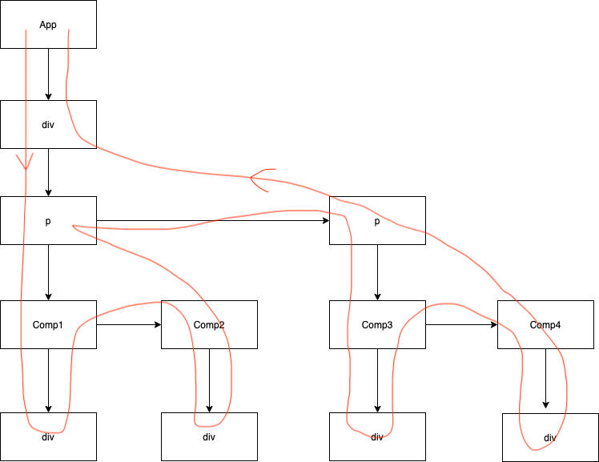

# React-流程概览

> 本文:
> 默认读者已了解`Fiber`架构原理；
> 只讨论同步模式(`legacy`)的情况，不关注调度器`scheduler`相关处理；
> 主要讨论`FunctionComponent`；
> 缩写：`wip`指`workInProgress`,`FC`指`FunctionComponent`；

## 整体流程

> `render`阶段：调和器`reconciler`工作阶段；
> `commit`阶段：渲染器`renderer`工作阶段

`fiber`结构：

```ts
function FiberNode(
  tag: WorkTag,
  pendingProps: mixed,
  key: null | string,
  mode: TypeOfMode,
) {
  // Instance
  this.tag = tag
  this.key = key
  this.elementType = null
  this.type = null
  this.stateNode = null

  // Fiber
  this.return = null
  this.child = null
  this.sibling = null
  this.index = 0

  this.ref = null

  this.pendingProps = pendingProps
  this.memoizedProps = null
  this.updateQueue = null
  this.memoizedState = null
  this.dependencies = null

  this.mode = mode

  // Effects
  this.flags = NoFlags
  this.subtreeFlags = NoFlags
  this.deletions = null

  this.lanes = NoLanes
  this.childLanes = NoLanes

  this.alternate = null
}
```

- `mount`时：

  - 调用`ReactDOM.render()`开始渲染
  - 调用`createContainer`创建`root`和`current rootFiber`
  - 调用`updateContainer -> scheduleUpdateOnFiber -> performSyncWorkOnRoot`依次进行`render`、`commit`阶段

- `update`时：
  - 调用`dispatchAction()`触发更新，调用`scheduleUpdateOnFiber -> ensureRootIsScheduled`依次进行`render`、`commit`阶段

下面分别介绍`render`阶段和`commit`阶段的流程：

## render 阶段

通过`renderRootSync -> prepareFreshStack`生成`wip rootFiber`(首次渲染过程中唯一存在`alternate`的`wip fiber`)，然后循环执行`workLoopSync -> performUnitOfWork`，而`performUnitOfWork`中包含`beginWork`和`completeUnitOfWork`，`completeUnitOfWork`又包含`completeWork`，执行过程为`深度优先搜索`，如下：

- `beginWork`返回`child wip fiber`作为新的`wip fiber`继续执行`performUnitOfWork`，直至`wip fiber === null`，这时执行`completeUnitOfWork`
- `completeUnitOfWork`以`wip fiber`作为`completedWork`进行循环
  - 先执行`completeWork`，然后判断`completedWork.sibling`是否存在
  - 若存在，则以`completedWork.sibling`作为`wip fiber`继续执行`performUnitOfWork`，`completeUnitOfWork`结束
  - 若不存在，则更新`completedWork = completedWork.return`继续循环，直至`completedWork === null`

下图所示的`fiber树`的执行过程如图中箭头所示，`向下`的过程为`beginWork`，`向上`的过程为`completeWork`



### mount 时

#### beginWork 过程

根据`ReactElement`(`wip.tag=FC`时，由`Component()`函数返回；`wip.tag=HostComponent`时，从`pendingProps.children`获取)经过`reconcileChildren`生成一个新的`child wip fiber`。

需要注意的是，`wip rootFiber`由于存在`current rootFiber`，其会执行下面 `update时`的流程，给其打上`Placement`的`effect tag`，最终在`commit`阶段将`应用根 HostComponent`挂载到`dom树`中

#### completeWork 过程

会为`tag === HostComponent`的`completedWork`创建对应的`dom`节点，并将子`dom`节点`append`上去。当执行到`tag === HostRoot`的`completedWork`时(`rootFiber`)，会更新`root.pendingChildren`，最终在`commit`阶段根据其完成首次渲染

此外`completeWork`会通过`bubbleProperties`给`wip fiber`打上`childLanes`和`subtreeFlags`，分别用来简化`render`阶段遍历路径和`commit`阶段遍历路径

### update 时

> 下面涉及的`fiber.lane`相关请查看[React-lane 解析](./React-lane解析.md)；
> 下面说的`复用`指最终通过调用`createWorkInProgress`复用`current fiber`属性生成`wip fiber`的方式；

#### beginWork 过程

若`current fiber`存在，则根据当前的`wip fiber`、`current fiber`的新旧`props`以及`wip fiber.lanes`来判断是否可以调用`bailoutOnAlreadyFinishedWork`进行复用

- 若可复用，则进行如下`bailoutOnAlreadyFinishedWork`复用流程：

  - 若子`fiber`有需要进行的工作(`fiber.childLanes`)，则调用`cloneChildFibers -> createWorkInProgress`根据`child.pendingProps`、`current child fiber`上需要复用的属性(如`flags、lanes、child、sibling、memoizedProps、memoizedState、updateQueue`等)生成一个新的`child wip fiber`(更新了原`child wip fiber`的属性)
  - 否则，直接复用当前`wip fiber`且返回`null`停止遍历

- 若不可复用且为`FC`，则执行`renderWithHooks -> Comp()`调用`updateReducer`判断是否`!is(newState, hook.memoizedState)`，若满足则也会调用`bailoutOnAlreadyFinishedWork`进行复用，否则进行如下`diff`流程：

  - 若`newChild`不为`Array`，则调用`reconcileSingleElement`进行单节点的`diff`
    - 若`key、elementType`相同，则：
      - 删除多余的`sibling`
      - `useFiber -> createWorkInProgress`复用生成一个新的`child wip fiber`
    - 否则，删除`fiber`和多余的`sibling`并使用`createFiberFromElement`创建一个新的`child wip fiber`
  - 否则，调用`reconcileChildrenArray`进行多节点的`diff`
    - 第一轮遍历，仅处理对应`index`位置`key、type`相同可复用的情况，不满足时跳出第一轮遍历
    - 先处理`newChildren`遍历完但`oldFiber`未完的情况，方法是删除多余的`sibling`，之后进行第二轮遍历
    - 第二轮遍历，处理`oldFiber`遍历完但`newChildren`未完的情况，方法是新增缺少的`newFiber`
    - 第三轮遍历，遍历`oldFiber`生成`map`用于与`newChildren`比对，记录`lastPlacedIndex`用于进行`仅右移`判断(`oldIndex >= lastPlacedIndex`时保持原位置不需要移动，而不符合时则需要进行移动操作)，不符合`仅右移`的`oldFiber`需要移动到最后

- 若不可复用且不为`FC`，同样进行上述`diff`流程

> `删除fiber`操作是将其保存到父`fiber`的`deletions`中，在`commit`阶段删除，其不再存在于`wip fiber`树中，只会执行`destroy`相关的钩子

#### completeWork 过程

会处理当前`tag === HostComponent`的`wip fiber`的`props`，生成包含更新`props`的`wip fiber.updateQueue`(结构为`[key1, value1, key2, value2]`)

同样会调用`bubbleProperties`给`wip fiber`打上`childLanes`和`subtreeFlags`

## commit 阶段

可大体分为如下过程：`开始`、 `commitBeforeMutationEffects`、`commitMutationEffects`、`commitLayoutEffects`、`结束`，会沿着打了`subtreeFlags`的`fiber`进行遍历从而优化遍历过程

`开始`和`结束`阶段会处理`passiveEffect`(useEffect 等)，如下：

1、`开始`阶段调度 `passiveEffect` 后`执行`

```ts
scheduleCallback(NormalSchedulerPriority, () => {
  flushPassiveEffects()
  return null
})
```

2、`结束`阶段赋值`rootWithPendingPassiveEffects`，用于后续执行的`flushPassiveEffects`函数内部

```ts
if (rootDoesHavePassiveEffects) {
  // This commit has passive effects. Stash a reference to them. But don't
  // schedule a callback until after flushing layout work.
  rootDoesHavePassiveEffects = false
  rootWithPendingPassiveEffects = root
  pendingPassiveEffectsLanes = lanes
}
```

下面我们再看看中间的三个子阶段：`commitBeforeMutationEffects`、`commitMutationEffects`、`commitLayoutEffects`

### commitBeforeMutationEffects

在`DOM`操作前，进行需要的准备工作，如删除元素后是否需要`focus`/`blur`等

### commitMutationEffects

当遍历到包含`deletions`的`fiber`时，进行`删除 DOM`操作；当遍历到`HostComponent || HostText`时，根据`fiber.flags`进行`删除以外的 DOM`操作。`DOM`操作完成后重置这 2 个标识

- 当`fiber.child`或`child.sibling`为`FC`且在`fiber.deletion`内时，调用`FC`的`updateQueue`内所有的`effect hook`回调返回的清理函数
- 当遍历到`FC`时，会沿着`fiber.updateQueue`上的`effect hook单向链表`进行相关的处理：若当前`FC`包含`PlacementAndUpdate | Update`的`flag` 且当前`effect hook`包含`HookLayout | HookHasEffect`的`flag`，则执行`useLayoutEffect`上次的回调返回的清理函数

`commitMutationEffects`过程结束后会使用`root.current = finishedWork`切换应用的`wip rootFiber`，原来的`current rootFiber`就变成了下次调度时的`wip rootFiber`

### commitLayoutEffects

- 当遍历到`FC`时，会沿着`fiber.updateQueue`上的`effect hook单向链表`进行相关的处理：若当前`effect hook`包含`HookLayout | HookHasEffect`的`flag`，则执行`useLayoutEffect`的回调
