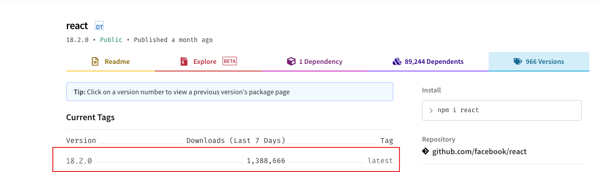

# React18:可能不是你想象中的时间切片

### 背景

随着`React18`的正式发布，`Concurrent API`已经稳定，目前 npm 默认版本已经指向`18.2.0`，也有着不小的下载量，相信未来会有越来越多的项目用上`React18`，这里我们主要来了解下用于解决`CPU瓶颈`的`时间切片`(`time slicing`)



### 什么是优先级调度？

要说`时间切片`，`优先级调度`必然也是要说到，为什么呢，因为`时间切片`这项`feature`仅在`并发调度`时启用，那么何为`并发调度`？
`并发调度`你可以理解为手动控制调度的优先级，可以让你认为的低优先级任务延迟执行，这里我们只简单提下在`React18`中如何开启使用，只需使用新的`Concurrent API`将调度标记为低优先级即可(如下示例使用的`useTransition`)

### 这种情况时间切片`有效`吗？

如下`code`，存在一个耗时组件`BusyComp`，`render阶段`会花费`1000ms`，我们对其使用`memo`进行了优化，同时使用`startTransition`标记了`setText`为低优先级调度，后续仅有`setCount`(高优先级调度)执行时，其不会重复`render`。
通过这 2 个不同优先级的调度，我们就可以判断出`时间切片`是否`有效`

```ts
import React, {
  useState,
  useTransition,
} from 'react'

const BusyComp: React.FC<{
  text: number
}> = React.memo(({ text }) => {
  const current = performance.now()
  while (performance.now() - current < 1000) {
    // something
  }

  return <div>I'm busy...{text}</div>
})

export default function TransitionComp() {
  const [isPending, startTransition] =
    useTransition()
  const [count, setCount] = useState('')
  const [text, setText] = useState(0)

  return (
    <div>
      <input
        value={count}
        onChange={({ target: { value } }) => {
          setCount(value)
          startTransition(() => {
            setText((c) => c + 1)
          })
        }}
      />
      <div>
        {isPending && <div>加载中</div>}
        <BusyComp text={text}></BusyComp>
      </div>
    </div>
  )
}
```

这里给出答案：`在连续进行输入操作时，明显能感受到高优先级的count渲染卡顿，卡顿时间与耗时组件render时间一致，无法获得丝滑的渲染体验~`，这里认为时间切片`失效`

效果如下：


### 那么时间切片适用于什么场景呢？

首先我们思考下为什么上面的例子里时间切片`失效`了，耗时组件的`render`过程中，是执行同步的`script`，这个执行过程中`React`也是没有办法中断的，`script执行`和`UI渲染`都在主线程上，也就阻塞了`UI渲染`，出现明显卡顿，时间切片`失效`

我们修改下`BusyComp`部分代码，如下，这时候时间切片又是否有效呢？

```ts
let num = 0
const BusyComp: React.FC<{
  text: number
}> = React.memo(({ text }) => {
  const current = performance.now()
  while (performance.now() - current < 10) {
    // something
  }

  if (num < 100) {
    num++
    return <BusyComp text={text} />
  }

  num = 0
  return <div>I'm busy...{text}</div>
})
```

结果是获得了如德芙般丝滑的体验~，`setCount`这个高优先级调度渲染完全不受影响，而低优先级的`setText`调度则被打断（低优先级任务不会被`饿死`，不同优先级的任务有不同的`timeout`时间，`timeout`时间到了就会立即执行，可以尝试连续输入几秒，会发现低优先级的`text`也会断断续续地渲染出来），`render`阶段被`切片`，在浏览器的每一帧中都让出了`UI渲染`的空闲时间

效果如下：


这里就可以得出结论，`时间切片`更适用于`fiber树`巨大但不存在`单个fiber` render 耗时巨大的情况

感谢大家的阅读~
