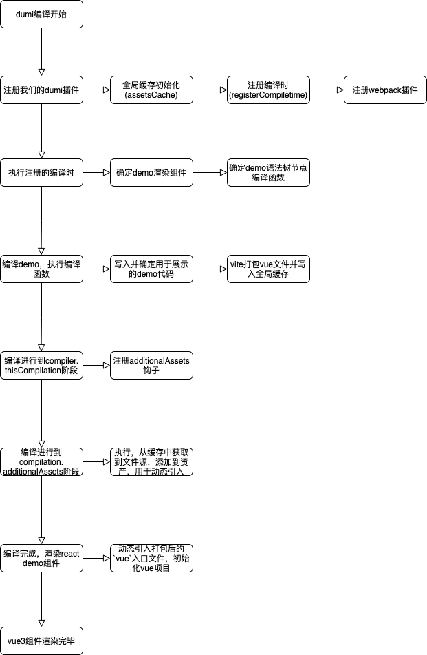

# dumi 支持 vue3 组件

## 什么是 dumi？

dumi，中文发音**嘟米**，是一款为组件开发场景而生的文档工具，负责组件开发及组件文档生成

在使用 dumi 编写`react`组件文档时，可以很方便地在`markdown`中引入`demo`并预览，比如下面的方式：

```markdown
<code src="/path/to/complex-demo.tsx"></code>
```

但是由于其不支持引入`vue3`组件`demo`进行预览，默认情况下便无法满足开发`vue`组件库的需求，下面我们一步步来实现其对`vue3`组件的支持，下面先放上整体的流程图：



## 如何支持 vue3 组件

在[dumi 插件开发](https://d.umijs.org/zh-CN/plugin#%E6%8F%92%E4%BB%B6%E5%BC%80%E5%8F%91)的介绍中，我们看到有提供注册自定义 demo 编译时的 API，如下图：


介绍中提到：我们可以`在这个环节将 demo 渲染节点替换成自行包装过的 React 组件，在该 React 组件中做其他技术栈的渲染`，好了，这就是我们需要使用的 API

根据介绍，首先我们需要指定一个 demo 渲染组件，这个组件用来作为`vue3`渲染的容器，在这个组件里我们需要使用`createApp`来初始化`vue3`应用，这里我们可以通过动态引入(`import()`)来引入`vue3`入口文件，详情如下：

```ts
import React, { useRef, useEffect } from 'react'
import { createApp } from 'vue'
import Antd from 'ant-design-vue'
import 'ant-design-vue/dist/antd.less'
import '@ant-design-vue/pro-layout/dist/style.css'

const VUE_COMPONENT_NAME =
  'fta-internal-component-name'

export default function VueContainer(props: {
  demoPath: string
}) {
  const vueInstance = useRef<any>()

  const init = async () => {
    const demoPath = props.demoPath

    let fetchResult = await import(
      /* webpackIgnore: true */ demoPath
    )

    if (fetchResult.default) {
      vueInstance.current = createApp(
        fetchResult.default,
      )
      vueInstance.current.use(Antd)
      vueInstance.current.mount(
        '#' + VUE_COMPONENT_NAME,
      )
    }
  }

  useEffect(() => {
    init()

    return () => {
      vueInstance.current?.unmount?.()
    }
  }, [])

  return <div id={VUE_COMPONENT_NAME}></div>
}
```

然后我们需要修改 demo 语法树节点编译函数，通过查阅 [dumi 类型定义](https://github.com/umijs/dumi/blob/202b2c8d56a3b670e1f4172be2794452028194db/packages/preset-dumi/src/transformer/remark/index.ts#L90) 并结合打印，我们获取到 demo 的代码，写入`dumi临时目录`，用于`sources`中代码的展示；然后再通过`rendererProps`传入上面写入的额外资产的路径，用于动态引入

为了能够动态引入，我们首先需要将入口文件编译成`js`，这里我们通过`vite`进行`vue`文件的编译打包。另外，由于我们打包出来的`js`文件并未被`dumi`的`dev-server`托管，我们无法直接通过路径引入，但我们可以先在`dumi`编译产物中手动添加额外的资产（我们打包出的`js`文件）再进行引入，这里我们通过 dumi 提供的`api.chainWebpack`添加额外的 webpack 插件结合文件缓存实现

插件详情如下：

```ts
import { RawSource } from 'webpack-sources'
import { Compiler } from 'webpack'

const resolveCahe = () => {
  // @ts-ignore
  const { assetsCache } = globalThis
  const cacheList = assetsCache.getCache()
  return new Promise((resolve, reject) => {
    Promise.all(cacheList)
      .then(resolve)
      .catch(reject)
  })
}

class CopyPlugin {
  apply(compiler: Compiler) {
    // @ts-ignore
    compiler.hooks.thisCompilation.tap(
      'copy-process-assets',
      (compilation) => {
        compilation.hooks.additionalAssets.tapAsync(
          'copy-process-assets-plugin',
          async (callback: () => void) => {
            const assets = await resolveCahe()
            // @ts-ignore
            for (const asset of assets) {
              compilation.assets[asset.path] =
                new RawSource(asset.content)
            }
            callback()
          },
        )
      },
    )
  }
}

export default CopyPlugin
```

缓存详情如下：

```ts
type TCacheItem = {
  key: string
  content: Promise<{
    path: string
    content: string
  }>
}
class AssetsCache {
  _cacheList: TCacheItem[] = []

  setCache = (prom: TCacheItem) => {
    this._cacheList.push(prom)
  }

  getCache = () => {
    return this._cacheList
      .map((item) => item.content)
      .slice()
  }

  clearCache = (path: string) => {
    const index = this._cacheList.findIndex(
      (item) => item.key === path,
    )
    if (index > -1) {
      this._cacheList.splice(index, 1)
    }
  }
}

export default new AssetsCache()
```

最终 dumi 插件入口文件如下：

```ts
import { IApi } from '@umijs/types'
import { join, relative } from 'path'
import assetsCache from './cache'
import buildVue from './buildVue'
import CopyPlugin from './additionalAssetsPlugin'

export default (api: IApi) => {
  // 全局变量 缓存 vue 编译产物
  ;(globalThis as any).assetsCache = assetsCache

  // 注册编译时
  api.register({
    key: 'dumi.registerCompiletime',
    fn: () => {
      return {
        // 编译时名称，唯一
        name: 'testregisterCompiletime',
        // demo 渲染组件
        component: join(
          __dirname,
          'previewer.js',
        ),
        // demo 语法树节点编译函数
        transformer: ({
          attrs, // code 标签的属性
          mdAbsPath, // 当前 Markdown 文件的路径
          node, // 语法树节点
        }: {
          attrs: any
          mdAbsPath: any
          node: any
        }) => {
          const { source, lang } = node.properties

          const vueRelativePath = relative(
            api?.paths?.absSrcPath ?? '/',
            mdAbsPath,
          ).replace(/\.md$/, '.vue')

          /**
           * 1.tempVuePath 相对路径
           * 在调用 umi 的 writeTmpFile 方法时，直接用相对路径即可
           */
          const tempVuePath = join(
            'dumi',
            'vue',
            vueRelativePath,
          )
          /**
           * 2.tempJsPath js 缓存的路径
           * vue compiler 打包后的 js 文件
           */
          //! 注意一定要绝对路径 不加  ’/‘
          const buildJsPath =
            'vue/' +
            vueRelativePath.replace(
              /\.vue$/,
              '.js',
            )

          /**
           * 3.absVuePath 相对路径
           * 在使用 vite 手动 compile 时，需要使用绝对路径
           */
          const absVuePath = join(
            api?.paths?.absTmpPath ?? '/',
            tempVuePath,
          )

          api.writeTmpFile({
            path: tempVuePath,
            content: source,
          })
          // @ts-ignore
          const { assetsCache } = globalThis
          assetsCache.clearCache(absVuePath)
          assetsCache.setCache({
            key: absVuePath,
            content: buildVue(absVuePath)
              .catch((err) => {
                console.error(err)
              })
              .then((res) => {
                return {
                  path: buildJsPath,
                  content: res,
                }
              }),
          })

          // 如果是 `<code>` 标签，则返回自定义的组件
          return {
            //  展示用的 内容
            previewerProps: {
              sources: {
                _: { path: absVuePath },
              },
              // 该 demo 依赖的三方库
              dependencies: {},
            },
            // demo 渲染器的 props，会传递给上面注册的渲染器组件 即： previewer.js
            // rendererProps: { demoPath: '/vue/Foo/index.js' },
            rendererProps: {
              //! 注意一定要加 ’/‘
              demoPath: './' + buildJsPath,
            },
          }
        },
      }
    },
  })

  api.chainWebpack((config) => {
    config
      .plugin('copy-process-assets-plugin')
      .use(CopyPlugin)
    return config
  })
}
```
