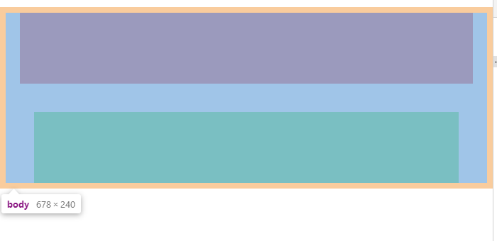
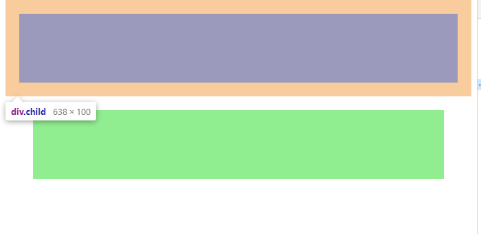
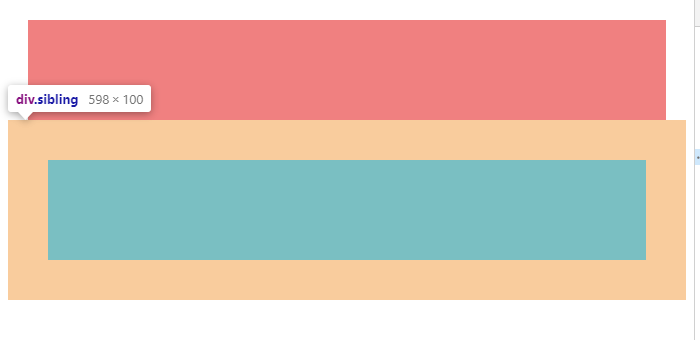
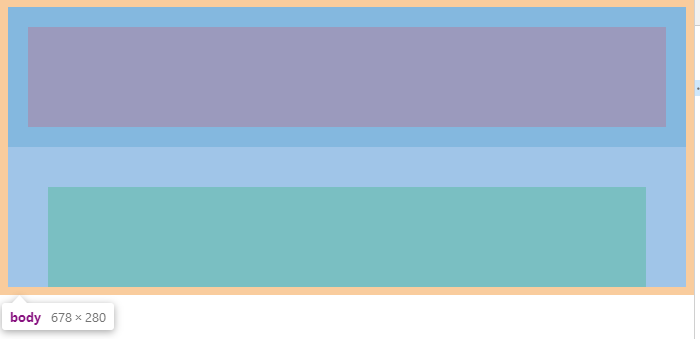
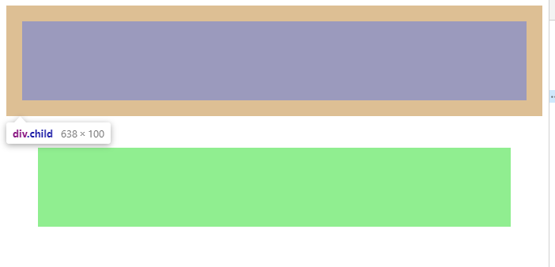
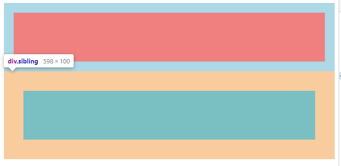
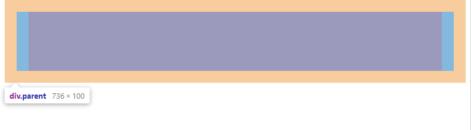
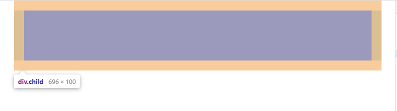
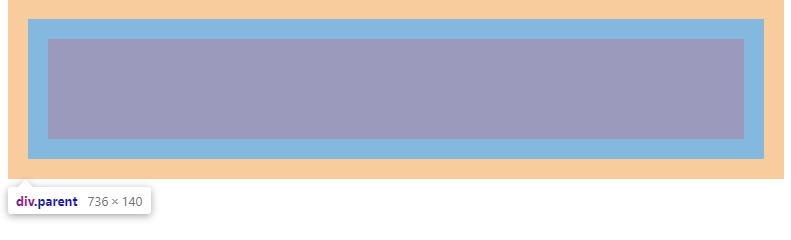
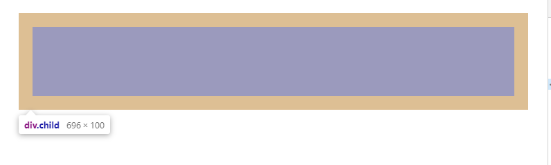

# CSS-BFC 理解

### 定义

块格式化上下文（Block Formatting Context，BFC）  是 Web 页面的可视化 CSS 渲染的一部分，是布局过程中生成块级盒子的区域，也是浮动元素与其他元素的交互限定区域。

### 触发条件

- 根元素(指 html,body 并不会生成 BFC)
- positon: absolute/fixed
- display: inline-block / table-cell / table-caption / table...(分别是 HTML table、row、tbody、thead、tfoot 的默认属性)
- float 元素
- ovevflow !== visible 并且该值没有传播到 viewport(except when that value has been propagated to the viewport)
  - 传播举例：
    1. body 设置宽度和背景色，发现背景色传递到了视口
    2. body 设置 width:300px、height:300px，当视口高度小于 300px 时,视口出现滚动条，此时若给 body/html 设置 overflow:scroll 会发现没有出现新的滚动条，因为它们的设置传播到了视口，只有当 html、body 都设置 overflow:scroll 才会出现双滚动条，也就是说这样阻止了传播，这便可解释为什么给 body 设置 overflow 无法生成 BFC 的现象
- 弹性元素(display:flex/inline-flex 的子元素) / 网格元素(display:grid/inline-grid)

### 规则

- 内部的 Box 会在垂直方向，一个接一个地放置
- Box 垂直方向的距离由 margin 决定。属于同一个 BFC 的两个相邻 Box 的 margin 会发生重叠
- BFC 中每个 Box 的左边缘与包含块的左边缘接触，即使是浮动元素也是如此，除非浮动元素左侧的框建立了 BFC（即 BFC 的区域不会与 float box 重叠）
- BFC 就是页面上的一个隔离的独立容器，容器里面的子元素不会影响到外面的元素。反之也如此
- 计算 BFC 的高度时，浮动元素也参与计算

### 应用

#### 阻止 margin 重叠

> 重叠会发生在三种情况下：
>
> 1. 兄弟 box 的 margin-top 和 margin-bottom
> 2. 父子 box 的 margin-top 和 margin-top 及 margin-bottom 和 margin-bottom
> 3. 空 box 自身的 margin-top 和 margin-bottom

示例 1 ：阻止相邻 box 及嵌套 box 的 margin 重叠

```
<!DOCTYPE html>
<head>
    <title>BFC</title>
    <style>
        .parent {
            background-color: lightblue;
        }
        .child{
            background-color: lightcoral;
            height: 100px;
            margin: 20px;
        }
        .sibling{
            background-color: lightgreen;
            height: 100px;
            margin: 40px;
        }
    </style>
</head>
<body>
    <div class="parent">
        <div class="child"></div>
    </div>
    <div class="sibling"></div>
</body>
```





示例代码效果如图所示，可以发现：child、sibling 的 margin-bottom 重叠在了一起，body、child 的 margin-top 也重叠在了一起

**BFC 内的子元素受到 BFC 的隔离，无法影响到外界，故而阻止了重叠。** 给 child 添加 parent BFC，如下：

```
<!DOCTYPE html>
<head>
  <title>BFC</title>
  <style>
    .parent {
      background-color: lightblue;
      overflow: hidden;
    }
    .child {
      background-color: lightcoral;
      height: 100px;
      margin: 20px;
    }
    .sibling {
      background-color: lightgreen;
      height: 100px;
      margin: 40px;
    }
  </style>
</head>
<body>
  <div class="parent">
    <div class="child"></div>
  </div>
  <div class="sibling"></div>
</body>
```





示例 2：阻止嵌套 box 的 margin 重叠（注意使用 overflow 使 body 生成 BFC 时，需要同时给 html 设置 overflow）

```
<!DOCTYPE html>
<head>
  <title>BFC</title>
  <style>
    .parent {
      background-color: lightblue;
      margin: 20px;
    }
    .child {
      background-color: lightcoral;
      height: 100px;
      margin: 20px;
    }
  </style>
</head>
<body>
  <div class="parent">
    <div class="child"></div>
  </div>
</body>

```




示例代码效果如图所示，可以发现：parent、child 的 margin-top 和 margin-bottom 重叠在了一起

**由于 BFC 内的子元素无法影响到外界，故而 BFC 内的子元素无法和父级发生重叠，为什么？可以试想，如果 BFC 内的子 box 可以和父级发生重叠，父级又可以和兄弟 box 发生重叠，也就会出现子 box 间接地影响到了外界，而这是和规则不符的。** 给 parent 设置 overflow:hidden 生成 BFC，效果如下：




#### 用于清除浮动，计算 BFC 高度

可尝试上述阻止 margin 重叠示例 2 的例子，给 child 设置 float: left 即可查看效果

#### 自适应两栏布局

正常情况下,float 元素和块级元素一左一右置于同一行时，会发生重叠，而 BFC 区域不会和 float 区域重叠，故而块级元素创建 BFC 即可，如下：

```
<!DOCTYPE html>
<head>
  <title>BFC</title>
  <style>
    .other {
      background-color: lightgreen;
      width: 250px;
      height: 100px;
      float: left;
    }
    .child {
      background-color: lightcoral;
      height: 100px;
      overflow: hidden;
    }
  </style>
</head>
<body>
  <div class="other"></div>
  <div class="child"></div>
</body>

```

#### 阻止元素被浮动元素覆盖

同上述自适应两栏布局
