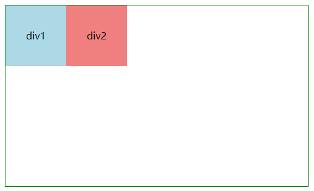
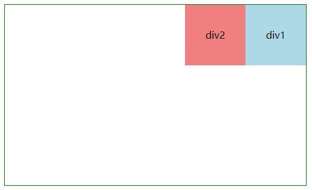
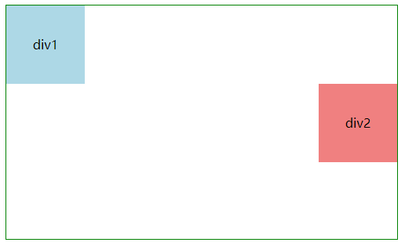

## 为什么需要浮动元素？

1. 行内/行内块级元素（文字、input、button、设置了**inline/inline-block**的元素 等等）环绕浮动元素，这也是 float 设计之初的目的，可以实现文字环绕图片等效果

2. 较早时期用来进行页面布局，现在有了 inline-block、flex、grid 等等更方便的方法

## 浮动元素布局原理

**浮动元素会根据属性值向左或向右浮动，浮动元素会脱离普通文档流，进入浮动流，浮动流内的浮动元素可以左右移动，直至外边缘碰到包含块或其他浮动元素，会使得块级元素无视浮动元素且行内元素环绕浮动元素（了解过层叠上下文的同学就会知道浮动层实际介于块级元素层和行内元素层之间）**

下面我们来看看各种浮动情况下的效果，页面元素、效果如下：

```js
<div class="app">
  <div class="div1">div1</div>
  <div class="div2">div2</div>
</div>
```

- 两个子元素均为 float:left

  

- 两个子元素均为 float:right

  

  我们发现：左浮动时，为由右向左移动，且下一行元素移至上一行时同样是由右向左，而右浮动同理

- 仅第二个子元素为 float:right

  

- 仅第一个子元素为 float:right

  这时它们在同一行上，我们发现：若浮动元素的上个块级元素不为浮动元素，其不可向上移动（上个元素为行内或行内块级时会上移，但不会重叠，而是环绕）

## 阻止父元素高度塌陷

clear:left/right/both <br/>
即不允许左/右两边有浮动元素，当前行上不会再有浮动元素（注意用于设置 clear 样式的 div 不要设置 float） <br/>

常用方式：

```scss
// 在需要'清除浮动'的元素的上侧或下侧添加div，并设置clear样式
.clear {
  clear: both;
}
// 设置父元素的伪元素
.wrapper-clear::after {
  content: '';
  display: block;
  clear: both;
}
// 设置父元素overflow: hidden等等将父元素变为BFC
```

关于 BFC 方面的内容，详见：[CSS-BFC 理解](./CSS-BFC理解.md)
