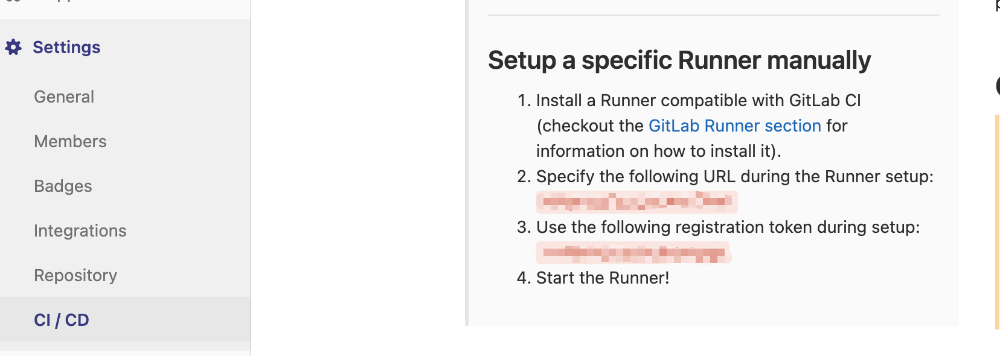
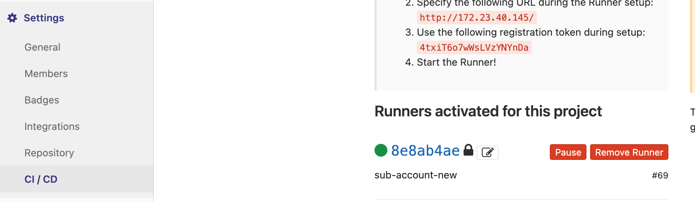

# GitLab-CICD 记录

## gitlab-runner

### 安装注册

> 基于 Ubuntu 7.5.0-3ubuntu1~18.04

1. 添加 GitLab 的官方存储库： `curl -L https://packages.gitlab.com/install/repositories/runner/gitlab-runner/script.deb.sh | sudo bash`
2. 安装最新版本的 GitLab Runner: `sudo apt-get install gitlab-runner`
3. 注册 GitLab Runner：`sudo gitlab-runner register`，之后分别输入 Gitlab 内提供的`URL`和`token`，即为下图中所示：
   
   验证注册成功：查看 Gitlab Runners 下，如下图出现注册的 runner 即可：
   
4. 启动 GitLab Runner：`sudo gitlab-runner start`，输入`executor`(shell 即可)

### 问题

- CI 默认执行用户为`gitlab-runner`，权限不足，需要新增权限或更改执行用户，这里在尝试新增权限(`sudo vim /etc/sudoers`)无果后更改执行用户后解决问题，步骤如下：
  1. 删除 gitlab-runner(可能无 service，继续下一步即可)：`sudo gitlab-runner uninstall`
  2. 安装并设置`--user`(这里设置为`root`)：`gitlab-runner install --working-directory /home/gitlab-runner --user root`
  3. 验证修改成功：`ps aux | grep gitlab`，`--user` 更新为 `root` 即可
  4. 重启 gitlab-runner：`service gitlab-runner restart`
